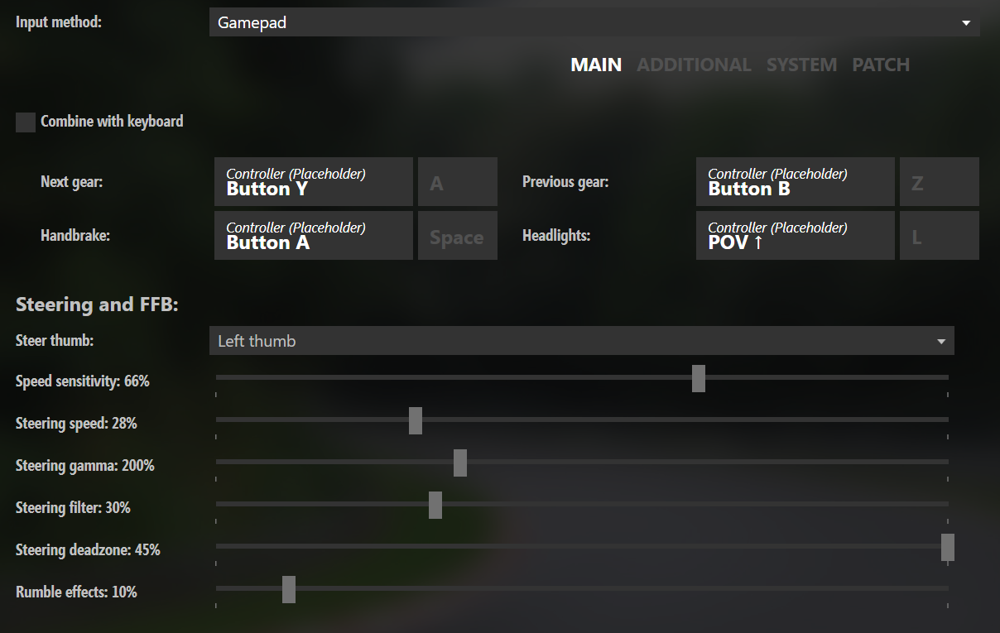

# ac_fun
Some Assetto Corsa Fun Stuff

## Install and Essential Mods
 - Main install from Steam
 - Register an account at https://www.racedepartment.com in order to downlaod mods
 - Content manager - https://acstuff.ru/app/
 - Custom Shaders Patch - https://acstuff.ru/patch/
 - SOL - https://www.racedepartment.com/downloads/sol.24914/

## Game Pad Setting
 - This one seems to work quite well on these cars (settings depend on cars as well) - https://www.youtube.com/watch?v=1T-Hl9qs-t8

 - acmc_impreza_time_attack
 - ks_nissan_gtr_gt3 (DLC pack)
 - rtm_subaru_cusco2008
 - toyota_supra_TRD_900bhp

  They can be found http://assetto-db.com and https://www.assettoland.net/
  
  Tested in these tracks, works really well!
 - Topanga Canyon - https://www.racedepartment.com/downloads/topanga-canyon-hillclimb.35858/
 - LA Canyon - https://www.racedepartment.com/downloads/la-canyons.15067/
 - Shutoko Revival Project (SRP), "Wangan Run Baby" - https://discord.gg/JydhbJG

